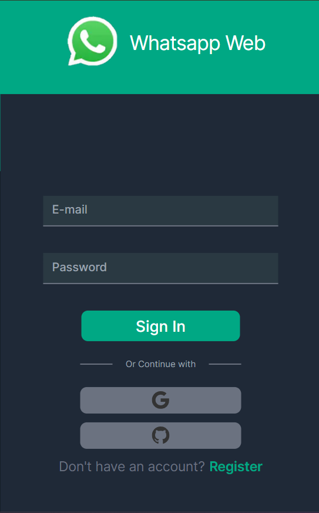

# Technologies

# Overwiev
A messaging application similar to WhatsApp, developed without using technologies like Socket.io or Pusher.

# Live Website
To see the project live, you can click [here](https://whatsapp-clone-iota-olive.vercel.app/).

## Example usernames and passwords for testing

| Username  | Password |
| ------------- |:-------------:|
| admin      | admin     |
| test      | test     |

## Images

